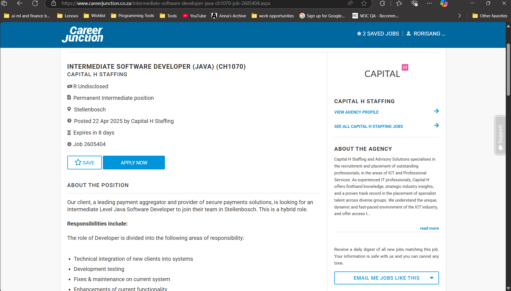

# PRP3-professional_practice_3--CV_submission

## 📤 5. CV Submission

### 📂 Evidence
- Screenshot of submission on Blackboard and Job Applications
- 
-  
- 
- Email confirmations or portfolio submissions

### 💭 Reflection (STAR)
**S**ituation:  
> Throughout the process of creating my CV with the guidance provided by the Work Readiness content in tHE Project Presentation module, I felt equipped with the tools to create a rendition of my inital CV, and after finalizing my CV, I began submitting it to entry-level roles and internships. 
 
**T**ask: 
> The main aim for the creation of my CV was to gain exposure to the expectation of what is required within a professional CV, and with various attempts at refining my CV I'd begun the process of networking in the industry.

**A**ction: 
> I submitted my CV via [LinkedIn/Indeed/Career Junction] and reached out to companies of interest. Throughout the process of job applications, I'd already been a part of the Work Integrated Learnership program and then wanted to use the experience to get employment that seemed more promising in the long run.
> 
**R**esult: 
> As much as I'd received feedback from friends and the guidance councellors, I'd went ahead and improved my CV layout and keywords. This also led to me builing  confidence in pitching myself and understanding what I want out of a profession.

---
